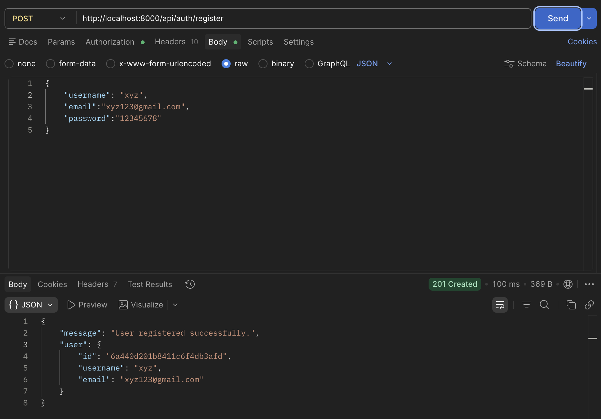
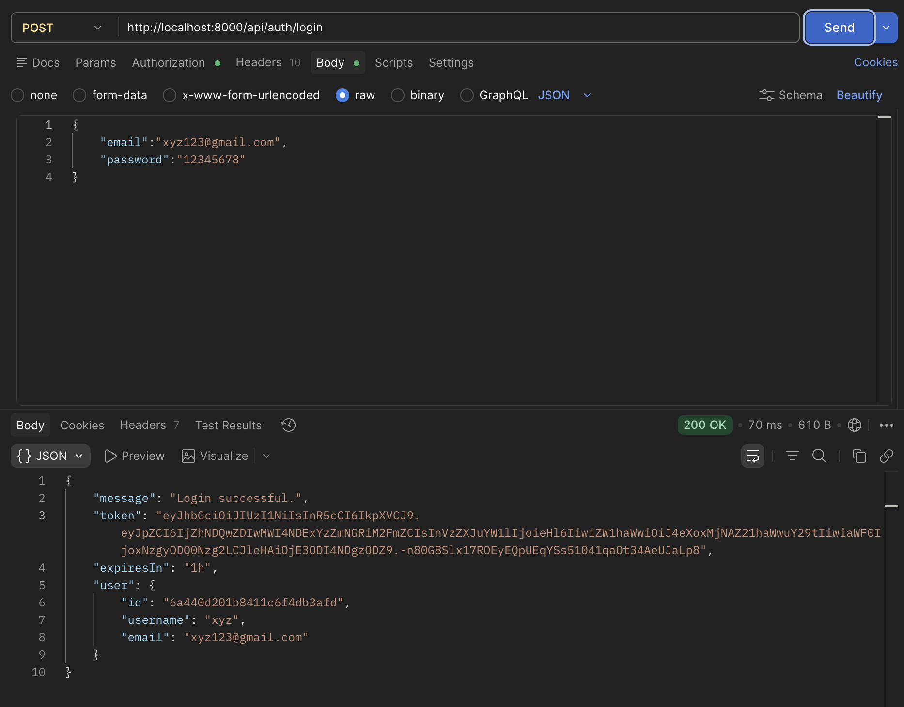
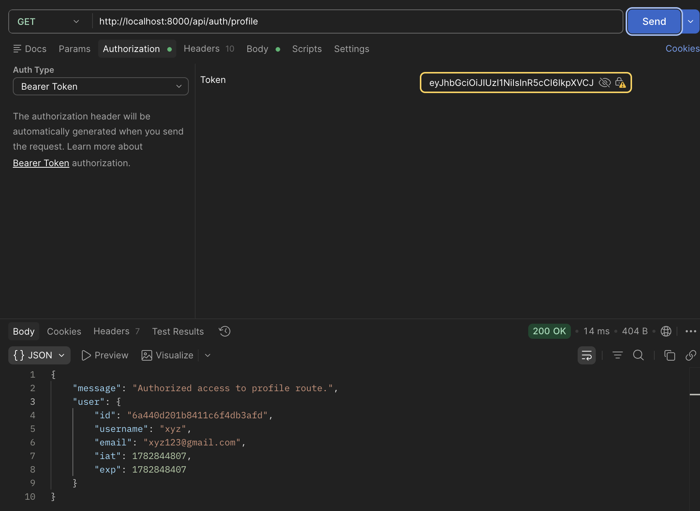
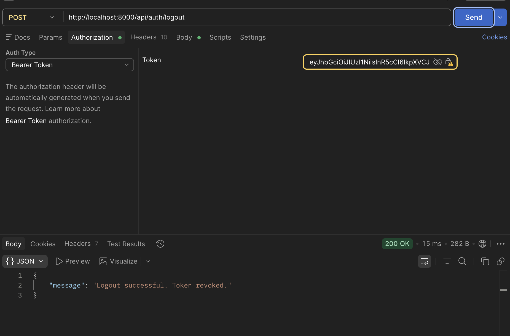

# Centralized Identity Provider (Authentication Microservice)

A backend authentication microservice built using **Node.js, Express.js, MongoDB, and JWT** that centralizes user authentication for multiple client applications.

The service provides secure user registration, login, logout, JWT-based authentication, password hashing using Node.js native **crypto (scrypt)**, token revocation through blacklist management, and custom rate limiting to protect against brute-force attacks.

---

# Features

- User Registration
- User Login
- JWT Authentication
- Protected Routes
- User Logout with Token Revocation
- Password Hashing using Native `crypto.scrypt`
- JWT Blacklisting
- Custom Rate Limiting
- Input Validation
- MongoDB Integration
- Environment Variable Configuration
- RESTful API Design

---

# Tech Stack

- Node.js
- Express.js
- MongoDB
- Mongoose
- JSON Web Token (JWT)
- Native Node.js Crypto (`scrypt`)
- dotenv

---

# Project Structure

```
auth-microservice
│
├── src
│   ├── config
│   ├── controllers
│   ├── middleware
│   ├── models
│   ├── routes
│   ├── utils
│   └── server.js
│
├── .env.example
├── package.json
├── .gitignore
└── README.md
```

---

# Prerequisites

Before running the project, install the following:

- Node.js (v18 or later)
- MongoDB Community Edition
- Git

Verify installation:

```bash
node -v
npm -v
mongod --version
git --version
```

---

# Installing MongoDB

### macOS (Homebrew)

```bash
brew tap mongodb/brew
brew trust mongodb/brew
brew install mongodb-community
```

Start MongoDB:

```bash
brew services start mongodb-community
```

Verify:

```bash
brew services list
```

You should see:

```
mongodb-community    started
```

---

# Clone Repository

```bash
git clone https://github.com/Vaibhav-3720/auth-microservice.git
cd auth-microservice
```

---

# Install Dependencies

```bash
npm install
```

---

# Environment Variables

Create a `.env` file in the project root.

Example:

```env
PORT=5000
MONGODB_URI=mongodb://127.0.0.1:27017/auth-microservice
JWT_SECRET=your_super_secret_key
```

---

# Running the Server

Development Mode

```bash
npm run dev
```

Production Mode

```bash
npm start
```

If everything is configured correctly, you should see:

```
[Database] MongoDB Connected successfully
[Server] Auth microservice listening on port 5000
```

---

# API Endpoints

## Register User

**POST**

```
/api/auth/register
```

Request Body

```json
{
    "username":"vaibhav",
    "email":"vaibhav@gmail.com",
    "password":"123456"
}
```

---

## Login

**POST**

```
/api/auth/login
```

```json
{
    "email":"vaibhav@gmail.com",
    "password":"123456"
}
```

Returns

- JWT Token
- User Information

---

## Profile

**GET**

```
/api/auth/profile
```

Header

```
Authorization: Bearer <JWT_TOKEN>
```

---

## Logout

**POST**

```
/api/auth/logout
```

Header

```
Authorization: Bearer <JWT_TOKEN>
```

The token is added to a blacklist and becomes invalid for future requests.

---

# Security Features

- Password hashing using native `crypto.scrypt`
- JWT Authentication
- JWT Expiration
- Token Blacklisting
- Protected Routes
- Request Rate Limiting
- Environment-based Configuration
- Input Validation

---

# Screenshots

## User Registration



---

## User Login



---

## Protected Route



---

## Logout



---

# Future Improvements

- Refresh Token Authentication
- Email Verification
- Password Reset via Email
- OAuth Integration (Google/GitHub)
- Role-Based Access Control (RBAC)
- Docker Support
- Swagger API Documentation
- Unit & Integration Testing

---

# What I Learned

This project helped me gain practical experience with:

- Building modular backend architectures
- Designing RESTful APIs
- JWT-based authentication and authorization
- Password hashing using native Node.js cryptography
- Middleware design in Express.js
- MongoDB schema design with Mongoose
- Token revocation using blacklist collections
- Request rate limiting
- Environment variable management
- Backend security best practices

---